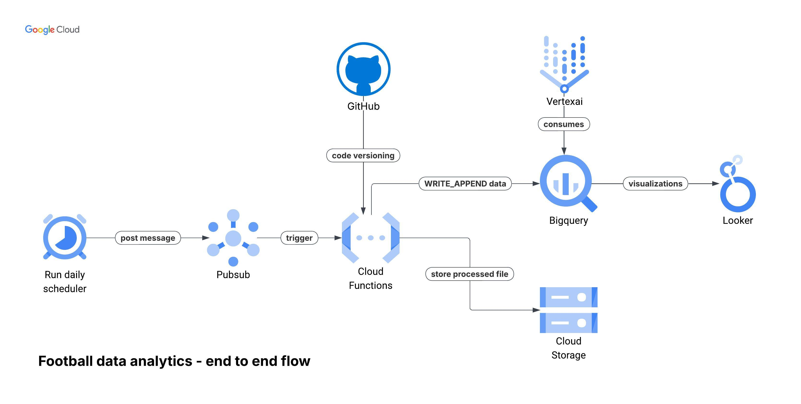

# Football Data Analytics - Superliga Datacamp - FRF

## Overview

## Features and functionality

## Architecture

### Components

## Future Enhancements

- Automate infrastructure deployment using Terraform.
- Automate dashboard creating and sharing.
- Integrate with AI layer to create dashboards on demand based on user prompt.
- Alerting, cost control and monitoring.